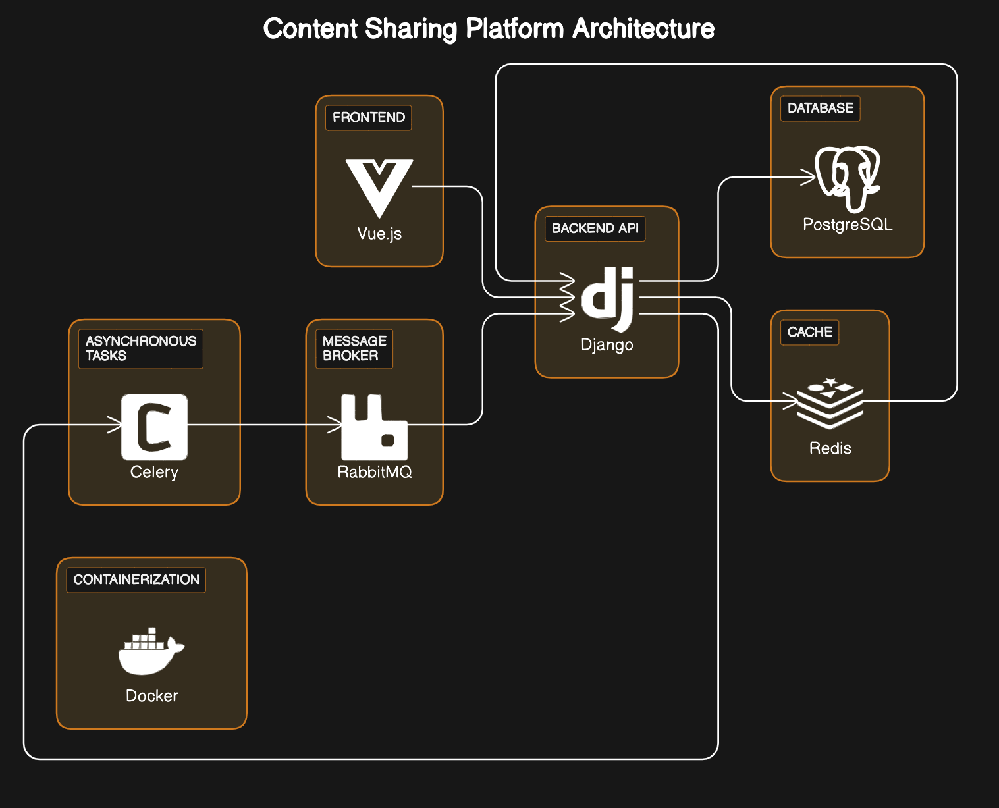

# Content Sharing Platform

## Overview

The Content Sharing Platform is a web application that allows users to share, discuss, and vote on content similar to popular platforms like Reddit or Hacker News. Users can submit posts, comment on existing posts, vote on posts and comments, and explore trending content.

## Features

- **User Authentication:** Users can sign up, log in, and log out securely.
- **Post Management:** Users can create, edit, delete their posts, and view posts created by others.
- **Comment System:** Users can comment on posts, reply to comments, and engage in discussions.
- **Voting System:** Users can upvote or downvote posts and comments, influencing their visibility and ranking.
- **Search:** Users can search for content they want
- **Notifications:** Users receive notifications for activities such as new comments on their posts or replies to their comments.

## Technologies Used

- **Frontend:** Vue.js
- **Backend:** Django
- **Database:** PostgreSQL
- **Caching:** Redis
- **Message Broker:** RabbitMQ
- **Task Queue:** Celery
- **Containerization:** Docker
- **CI-CD:** CircleCI
## System Architecture

## Getting Started

### Prerequisites

- Docker: Install Docker on your machine. [Docker Installation Guide](https://docs.docker.com/get-docker/)
- Docker Compose: Make sure you have Docker Compose installed. [Docker Compose Installation Guide](https://docs.docker.com/compose/install/)

### Running the Application

1. Clone the repository:

